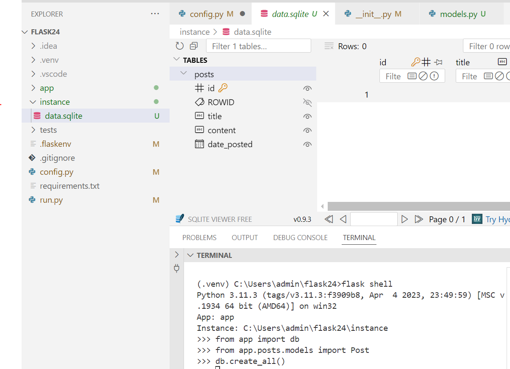

# Flask-SQLAlchemy
Flask-SQLAlchemy is an ORM that abstracts complex SQL queries, allowing you to interact with databases using Python classes.

## Documentation
- https://flask-sqlalchemy.readthedocs.io/en/stable/
- https://flask.palletsprojects.com/en/stable/patterns/sqlalchemy/

## Tutorials
- https://github.com/hackersandslackers/flask-sqlalchemy-tutorial
- https://codingnomads.com/python-flask-sqlalchemy-query-database
- https://neon.tech/guides/flask-database-migrations
- https://www.digitalocean.com/community/tutorial-series/how-to-create-web-sites-with-flask

## Code examples
- https://github.com/0brain/flask_sqlalchemy_tutorial
- https://github.com/JayBhatt2021/improved-flask-tutorial-app
- https://github.com/AnthonyRChao/flask-mega-tutorial-2024

{: width="30%"}